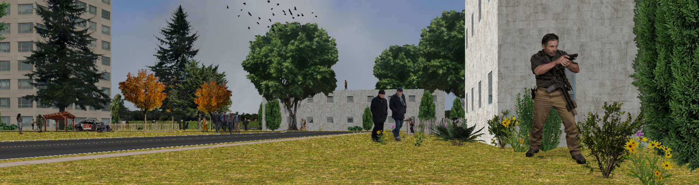
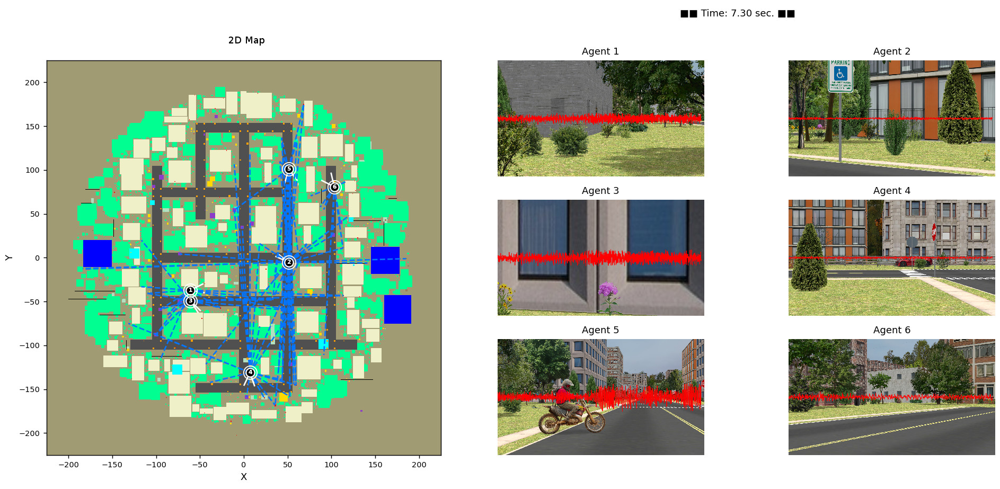

# Sensor Planning Simulation Environment

 
  
 
 

 
## Description

**The goal of this project is to provide a simulation environment to support the research and development of multi-agent, multi-sensor, surveillance algorithms in large, outdoor environments.**

This project supports the Army Research Laboratory's Internet of Battlefield Things (IoBT) program. 

<table>
<tr>
<td> 

 Display of one instant in a multiagent simulation.  Left: A 2D "map" representation of the environment.  White cones represent PTZ camera fields-of-view. Blue dashed lines represent possible acoustic detections. Right: Camera images and overlayed microphone sensor data as observed by the six agents shown in the 2D map. </td>

</tr>
</table> 

## Running the code

* Add "sim_world" to your PYTHONPATH environment variable.
* Edit multiagent.py to change various program parameters.
* Run it: python multiagent.py
 
## Author

Phil David

&nbsp;&nbsp;&nbsp;&nbsp; U.S. Army DEVCOM, Army Research Laboratory, 2020-04-07.

&nbsp;&nbsp;&nbsp;&nbsp; Parsons Corp., 2023-06-01.

