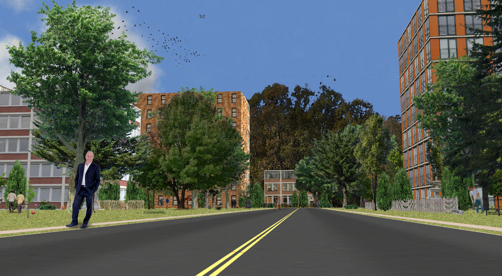
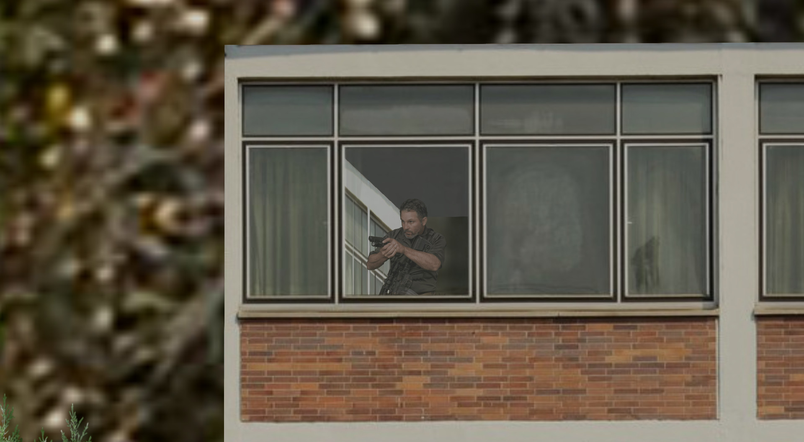

# Visual Search Project

 
  
 
 

 
## Description

**The goal of this project is to develop methods that enable autonomous agents to use pan-tilt-zoom (PTZ) cameras to efficiently search large outdoor environments for objects of interest, taking into account mission objectives and constraints.**

Given the scene in the left image below, and a mission to locate snipers, how does an agent quickly decide to zoom in on the distant building in order to locate the man with the gun?

<table>
<tr>
<td> 

 Wide-angle view of an urban environemnt. </td>

<td> 

 Zoomed-in view of distant building in scene to left. </td>

</tr>
</table> 

## Subprojects
- [Baseline search](./baseline_search/README.md) algorithm
- [Common code](./common/README.md) for all visual search work
- [YOLO object detector](./obj_detector/README.md) implemented by DeNA Co.
- [Outdoor environment simulator](./sim_world/README.md) for developing and testing algorithms

 
## Authors

Phil David, U.S. Army Research Laboratory, 2020-04-07.

