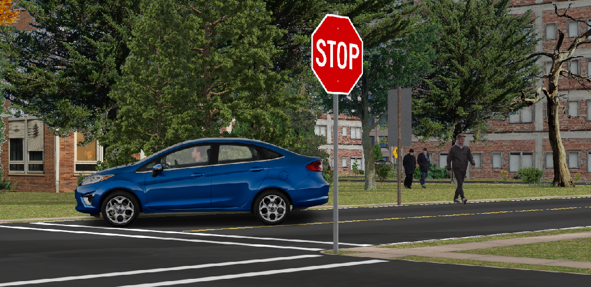
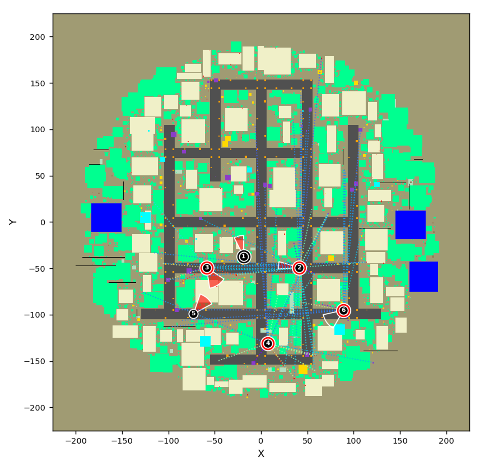
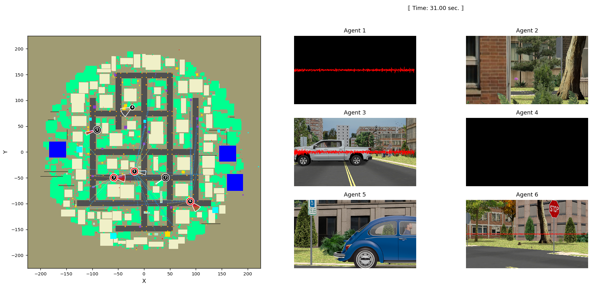

 

# Sensor Planning Simulation Environment
 
 
  
 
 
 
 
## Overview

**The goal of this project is to provide a simulation environment to support the research and development of multi-agent, multi-sensor, surveillance algorithms in large, outdoor environments.**

This project supports the Army Research Laboratory's Internet of Battlefield Things (IoBT) program (https://www.arl.army.mil/cras/iobt-cra/). 

This simulator procedurally generates random, quasi-photorealistic, 3D urban environments that may be used to train and evaluate mutl-agent perception and planning algorithms. The size and compexity of the generated environments, and the number of sensor-equiped agents, are limited only by the available computing resources. See the [sim_world/README](sim_world/README.md) file for more information about the simulator's capabilities.

 

## Multiagent, Multisensor Surveillance

<table>
<tr>
<td> 

 
The groundtruth map shows static and dynamic objects, agents,  and their sensors. Each agent may possess a camera and/or a  microphone. A camera is represented by a wedge showing the  camera's horizontal field of view. A microphone is represented by a double ring. A camera wedge or microphone ring is colored red when the camera or microphone, respectively, is turned on and  sensing the environment. In this figure, agent 1 has a camera and a microphone, but the microphone is turned off; agent 4 has just a microphone, which is turned on; agent 5 has just a camera; and agent 6 has a camera and a microphone with the camera turned off. For microphones that are powered on, we identify sound-producing objects that are in audible range of a microphone by connecting the object to the microphone with a colored dotted line, where the color indicates the strength of the audio signal at the microphone (red is a strong signal, blue is a weak signal). 
 </td>

</tr>
</table> 

## Multiagent Display

<table>
<tr>
<td> 

 Display at one instant in a multiagent simulation.  Left: A 2D "map" representation of the environment.  Red and transparent wedges represent PTZ camera fields-of-view. Red and black rings represent microphones. Colored dotted lines represent possible acoustic detections. Right: Camera images and overlayed microphone sensor data as observed by the six agents shown in the 2D map. </td>

</tr>
</table>

Here's a [video](./sim_demo.mp4) showing a short run of the simulator.

 

## Running the code

* See the sim_world [README](sim_world/README.md) file for setup information.

* Add "sim_world" to your PYTHONPATH environment variable.

* If desired, edit multiagent.py to change various program parameters.

* Run it:
~~~bash
$ python multiagent.py
~~~
 
  
 
## Author

Phil David

&nbsp;&nbsp;&nbsp;&nbsp; U.S. Army DEVCOM, Army Research Laboratory, 2020-04-07.

&nbsp;&nbsp;&nbsp;&nbsp; Parsons Corp., 2023-06-01.

