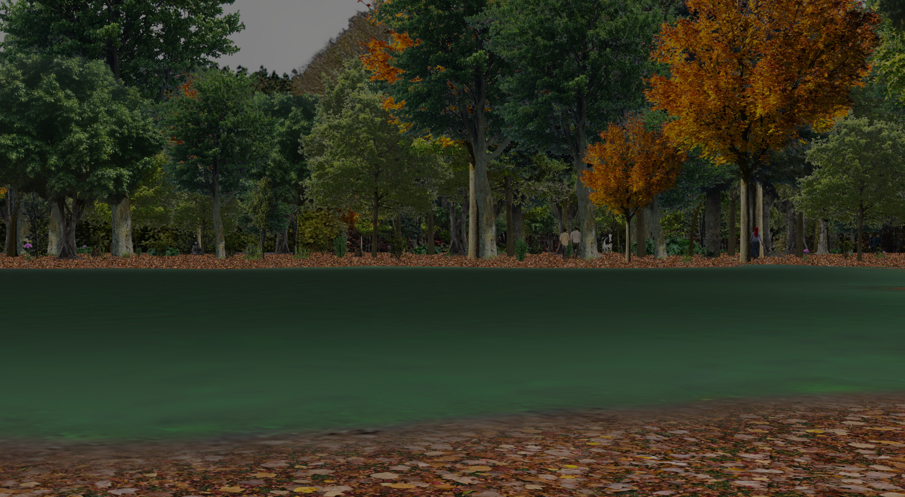

# Random Outdoor Environment Simulator

 
  
 
 

 
## Description
    
The random 3D outdoor environment simulator is designed to provide near photo-realistic imagery (see screenshots below) for training algorithms that rely on visual perception (computer vision) algorithms. Thus, almost all objects in the simulation are texture-mapped with real photos of those objects and are modeled in a way that preserves the photo-realism of the rendered scenes. High-definition semantic labels and depth imagery is also available. The randomness of the environment provides an unlimited number of environments to train or test in. This is essential for reinforcement learning algorithms. However, if desired, random environment generation can be turned off (via the *rand_seed* and other parameters) and the same environment can be used for all experiments. 

The simulator creates environments using a combination of 3D and 2D objects. Objects that must be stationary to produce convincing renderings of a scene, such as buildings, street signs, fences, and free-standing walls, are inserted into environemnts as 3D objects. All other objects, such as people and plants, whose orientations are less important, are inserted as 2D planar surfaces. To eliminate foreshortening of these 2D planar objects, they are always rotated about their vertical axes to face the camera. 

Most objects in the environment are represented with just two images, a color image (photo)  of the object and a corresponding pixel-wise, semantically labeled image. This makes it very easy to add additional objects to the simulator (see [Texture images](#texture-images) below) but also results in some limitations:

- Objects represented with 2D planes (e.g., people, plants, clutter) look the same from all viewpoints since they are always rotated to face the camera. It is not possible to see them from different sides, or to produce articulated motion of joints. 
- The appearances of buildings change with viewpoint, but they have the same facades on all four sides.
- The ground is always flat. 
- All roads (paved and unpaved) are straight and parallel to the X or Y axis.
- There is no physical feedback to constrain agent motion. 

Most of these limitations can be eliminated, if needed.

Currently, people are expected to be the main "objects of interest." Therefore, compared to other objects, there is a greater variety of ways to insert people into environments: people may be placed on the ground, on top of buildings, or inside of buildings looking out of windows.

All rendering of environments is performed using the Visualization Toolkit (VTK).  VTK is open source software for manipulating and displaying scientific data.  See https://vtk.org for more details. The complexity of environments is limited only by computational resources and processing time constraints.

### Audio

In June 2023, the simulator was enhanced to include simulation of sounds produced by certain objects (e.g., people, cars, motorcycles, and some animals). Agents (see below) may be outfitted with a microphone that can be used to sample these sounds. All audio signals produced by the simulation are scaled versions of real audio recordings of these objects. The amplitude of a sound is scaled by the distance between the source and microphone, relative to the distance at which the original recording was made. A given microphone produces an audio signal that is the sum of scaled audio of all objects within a fixed range and which are not obscured by buildings. 

### Mobile Agents

Any number of stationary or mobile agents may be inserted into the environment. Each agent may sense its surroundings using a pan-tilt-zoom (PTZ) camera and/or a microphone.

### Sample images

<table>
<tr>
<td> 

 Birds-eye view of a simulated urban environemnt. </td>

<td> 

An urban environemnt. Notice persons on roof and inside 3rd floor window. </td>

</table> 

<table>
<tr>
<td> 

 An urban environemnt with snow on ground. </td>

<td> 

 A wooded environemnt with a pond. </td>

</tr>
</table> 

<table>
<caption style="caption-side:bottom">
Corresponding color image (left), semantic labels (center), and depth (right) for a simulated urban environment.
</caption>
<tr>
<td> </td>
<td> </td>
<td></td>
</tr>
</table>

<table>
<tr>
<td> 

 Wide-angle view of an urban environemnt. </td>

<td> 

 Zoomed-in view of distant building in scene to left. </td>

</tr>
</table> 

## Texture images 
# 

Objects in the simulator are represented with two images: a color image and a corresponding pixel-wise, semantically labeled image.  In order to produce photo-realistic renderings of the environment, color images should be high-resolution photographs of the objects. Properties of these objects (e.g., real-world size, location constraints, etc.) are embedded in the file names. See this [README](./textures/README.md) file for more details.

## Prerequisites

- Python 3
- Required packages:
	- pytorch
	- torchvision
	- vtk 
	- matplotlib
	- opencv 
	- numpy 
	- imageio 
	- cudatoolkit 
	- sklearn 
	- pillow 
	- skimage 
	- sklearn 
	- scipy 
	- yaml 
	- munkres

## Running the code

Ensure that the folder *common* is in your PYTHONPATH environment variable. This folder contains a collection of miscellaneous code that is of general use to the visual search project. See this [README](./../common/README.md) file for more information.
    
There is a bug in the VTK 8.2.0 depth peeling code that results in errors when rendering translucent polygonal geometry. This problem is circumvented by setting the environment variable:
~~~bash
$ export VTK_USE_LEGACY_DEPTH_PEELING=1
~~~

Create a random urban environemnt and manually move a camera through it:
~~~bash
$ python simworld.py
~~~
 or
~~~bash
$ python make_urban.py
~~~ 
        
See the many options to SimWorld() to control the properties of the generated environemnts. SimWorld()'s *you_drive*() method allows a user to manually move a camera around the environment. When invoked, a "control menu" will be displayed that lists the keyboard commands used to move the camera. A 2D map of the world with the camera's current position is also displayed, as in the example below.

 
  
 
 

Note that camera forward and backward motions (up and down arrow on the keyboard) move the camera in the direction that the camera is pointing. So if the camera is tilted up and a move forward command is given, then the camera will move up and forward. The level (L) command can be used to level the camera before moving it so that the camera remains on the same horizontal plane.
        
Create a random forested environemnt and manually move a camera through it:
~~~bash
$ python make_forest.py
~~~
        
Test the baseline PTZ search from a random location in a random environment:
~~~bash
$ python ptz_search_baseline.py
~~~

## YOLO v3

This project uses the YOLO v3 object detector implemented (in PyTorch) by DeNA (https://dena.com/) and obtained from https://github.com/DeNA/PyTorch_YOLOv3. Shown below are YOLO detections on two images from the simulator.

<table>
<caption style="caption-side:bottom">
 YOLO object detections.  Detection confidences are displayed on the lower right corner of each detection.
</caption>

<tr>
<td></td>
</tr>
<tr>
<td></td>
</tr>

</table>

 
## Author

Phil David, U.S. Army Research Laboratory, 2020-04-07

## Change History

Phil David, Parsons Corp., 2020-04-07: Added audio simulation of objects and microphone sensors.

