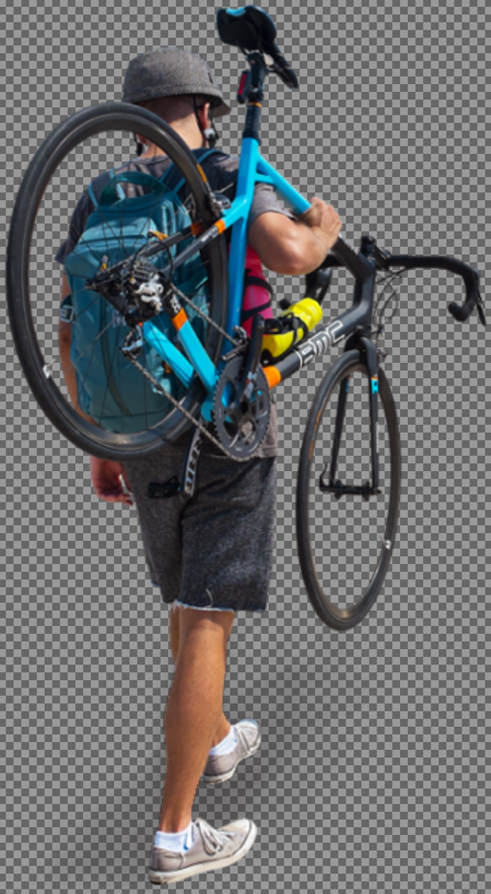
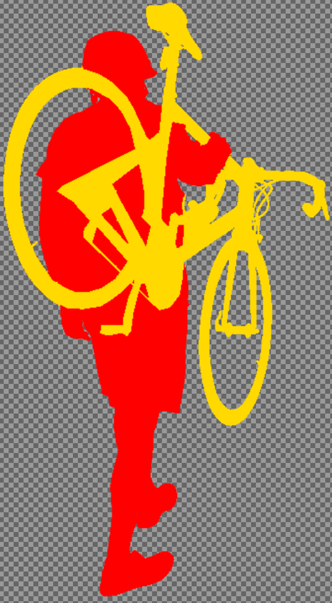
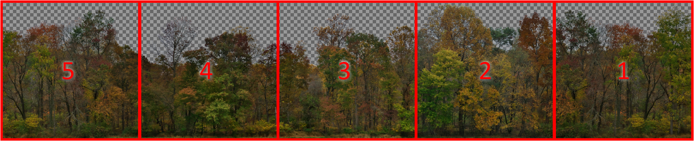
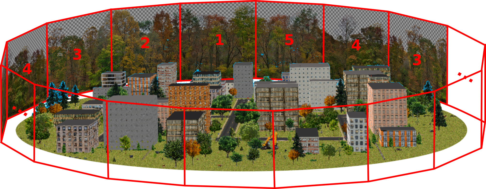

# Texture Images 
***(Document Under Construction)***

The *textures* folder contains all texture images used by the outdoor environment simulator to texture map objects in the environment, including the ground, sky, buildings, animals, people, vegitation, and miscellaneous clutter. Objects are completely defined by these images. The following is a short tutorial on how to add images to this folder in order to create new objects.

## Texture image files

It is important in images used to texture map 2D planar objects (representing 3D objects) that the contact points of the object with the ground are at or very close to the bottom of the image.  If this is not the case, then for certain viewpoints (i.e., cameras close to the ground plane), some of the object's contact points may appear to float above the ground plane.

Texture images must be either JPEG or PNG format, and either 24-bit RGB or 32-bit RGBA. The inclusion of an alpha channel in the PNG format images (32-bit RGBA) allow parts of these images, and therefore the corresponding objects in the simulated environment, to be partially or fully transparent. Without this transparency, all objects would appear to be rectangular. So, except when objects are really rectangular, such as buildings, or when texture mapping the ground or sky, PNG images are preferred over JPEG.

All texture image file names have the form <tags\>\.<ext\>  where <tags\> is a sequence of underscore-seperated tags describing properties of the scene elements that the texture image maps onto, and <ext\> is the file extension (*jpg, jpeg, or png*).  An individual tag can be any sequence of characters except for the underscore ("_"\). Tags may be either *simple* tags or *key/value tags*. A *simple* tag is any sequence of characters except "\_" and "=". A *key/value* tag has the form <key\>=<value\> where <key\> and <value\> are both *simple* tags.

All image files should include at a minimum, the following three *primary* tags:
	
-  Class of object that the image depicts
-  Class-unique integer identifier
-  Width and height, in meters, of the object

The order of tags in a file name does not matter, but for organizational reasons, we typically start with the class tag followed by the identifier tag, then the remaining tags (including the width-height tag). For example, a color image may be named
 
	plant_25_tree_winter_wh=5.5x12.png
  
to indicate that it is an image of a plant (the object class), which is a tree (subclass), during the winter season, and whose size is 5.5 meters wide by 12 meters tall. The tag "25" is the unique identifier within the class of "plant".  The "tree" tag is used by the simulator to seperate large plants from small plants. The "winter" tag is not currently used, but future enhancements could use it to render scenes where all elements are consistent with different seasons. As most color images require a corresponding image of semantic labels (see details below), there must also be an image in the *textures* folder named
 
 	plant_25_label_wh=5.5x12.png
 	
that provides these pixel-wise semantic labels. This file does not need to repeat all of the tags from the corresponding color image file, only the primary tags, but it must include the "label" tag. Note that some tags are context dependent: the same tag can have different interpretations depending on what other tags are present.

The following table gives a (possibly incomplete) list of recognized image file tags. **Bold** text represent tag variables and *italic* text represent string literals. All tags are case insensitive.

<table>
<tr><th> Title </th>  <th> Tag  </th> <th> Notes </th> </tr>

<tr><td> Object class </td><td> <b> C </b> </td><td> <b> C </b> &isin; {<i>airborne, animal, barrier, building, clutter, gndfeat,    &emsp; &emsp; ground, person, plant, road, sign, sky, unknown, water</i>} </td></tr>

<tr><td> Class ID </td> <td><b>ID</b> </td><td> The unique ID of the object within its class. <b>ID</b> &isin;  [<i>0,1,2,...</i>]. </td></tr>

<tr><td> Object size </td><td> <i>wh</i>=<b>W</b>x<b>H</b> </td><td> <b>W</b> and <b>H</b> are the real-world width and height, respectively, of the object, both in meters. </td></tr>

<tr><td> Animal subclass </td> <td> <b>T</b> </td><td>The type of animal: <b>T</b> &isin;  {<i>cat, cow, crow, deer, dog, fox, gndhog, sheep,  snake</i>}. </td></tr>

<tr><td> Barrier subclass </td> <td> <b>T</b> </td><td> The type of barrier: <b>T</b> &isin;  {<i>fence, wall</i>}. Fences are created with a set of regularly-spaced 3D fence poles and a 2D surface depicting the part of the fence that is held up by the fence poles.  Walls are free-standing 3D objects where all sides are texture-mapped with the same image.</td></tr>

<tr><td> Plant subclass </td> <td> <b>T</b> </td><td>The type of plant: <b>T</b> &isin;  {<i>fallen, flower, tree, weeds</i>}. A fallen tree is indicated by including the tags <i>tree</i> and <i>fallen</i>. </td></tr>

<tr><td> Flippable </td> <td> <i>noflip</i> </td><td> If <u>not</u> present, the texture image is flipped horizontally to provide an additional image of the object.  </td></tr>

<tr><td> Semantic labels </td> <td><i>label</i> </td> <td> This identifies the image as providing pixel-wise semantic labels </td></tr>

<tr><td> Max occurances </td> <td><i>mo</i>=<b>N</b> </td><td> The maximum number of occurances of the object in the environment.  <b>N</b> &isin;  [<i>0,1,2,...</i>]. </td></tr>

<tr><td> Speed </td> <td><i>spd</i>=<b>L,H</b> </td><td> The range of speeds (<b>L</b> is low, <b>H</b> is high) of the object, in meters/sec.  <b>L, H</b> &ge;  <i>0</i>. </td></tr>

<tr><td> Forward </td> <td><i>f</i>=<b>D</b> </td><td> The forward direction of the object is <b>D</b> where  <b>D</b> &isin;  {<i>L</i>, <i>R</i>]. <i>L</i> stands for left and <i>R</i> stands for right. When the object moves across the view of a camera, its image will be oriented so that the forward side is facing the direction of motion. 
 </td></tr>

<tr><td> On buildings </td> <td> <i>b</i> </td><td> This object may appear on the tops of buildings. </td></tr>

<tr><td> On roads </td> <td> <i>r</i> </td><td> This object may appear on or above (for airborne objects) roads. </td></tr>

<tr><td> In windows </td> <td> <i>w</i> </td><td> This object may appear inside of buildings looking out of windows. </td></tr>

<tr><td> Height above surface </td> <td> <i>z</i>=<b>H<b> </td><td> 
<b>H</b> is the height (in meters) of an <i>airborne</i> object above the surface (ground or building) below it. </td></tr>

<tr><td> Tile number </td> <td> <i>t</i><b>K</b> </td><td> Panoramic background images consist of a number of images stitched together. <b>K</b> is the tile number of an image in a panoramic.  See <u>Background scenes</u> below for more details. </td></tr>

<tr><td> Thickness </td> <td> <i>t</i>=<b>T</b> </td><td> <b>T</b> gives the thickness (in meters) of a free-standing wall. </td></tr>

<tr><td> Fence pole design </td> <td><i>p</i>=<b>ID</b>x<b>W</b>x<b>H</b>x<b>DL</b>x<b>DR</b>x<b>S</b> <td> 

This tag, which is used in <i>barrier_fence</i> images, determines the appearance and position of fence poles attached to a fence object:  
&emsp;  <b>ID</b> is the ID of a pole texture image (i.e., <i>pole_</i><b>ID</b>_[...]<i>.png</i>),  

&emsp; <b>W</b> and <b>H</b> are the width and height (meters) of the fence poles,  
 
&emsp; <b>DL</b> is the distance (meters), in the direction parallel to the fence, to the center of the 1st pole,  

&emsp; <b>DR</b> is the distance (meters), in the direction perpindicular to the fence, to the center of the 1st pole,  

&emsp; <b>S</b> is the inter-pole spacing (meters).
 </td></tr>
        
<tr><td> Fence pole shape </td> <td> <b>S</b> </td><td>The shape of a fence pole. <b>S</b> &isin;  {<i>r, s</i>} where <i>r</i> means round and <i>s</i> means square. </td></tr>

<tr><td> Back of sign </td> <td> <i>back</i> </td><td> This tag, used with <i>sign</i> textures, indicates that the texture image is the back side of a <i>sign</i> object. A <i>sign</i> texture image without this tag is assumed to be an image of the front of the sign. </td></tr>

<tr><td> Center of rotation </td> <td> <i>cr</i>=<b>R</b> </td><td> The horizontal center of rotation for the 2D object is set to <b>R</b> 
where <b>R</b>&isin;  [<i>0,1</i>] is the distance ratio from the left side of the image.  Use this when the contact point of the object with the ground is not in the center of the image.
 </td></tr>
 
<tr><td> Sign post position </td> <td> <i>sp</i>=<b>S</b> </td><td> 
This tag is used on <i>road</i> images. The distance of a road sign post from the center of the road is <b>S</b>&sdot;<b>W</b>&divide;2 where <b>S</b> is a floating point value and <b>W</b> is the width of the road (in meters).  On roads that include sidewalks, it is necessary to choose 0 < <b>S</b> < 1 in order to place road signs between the edge of the road and the sidewalk.  </td></tr>
 
 <tr><td> Window position </td> <td> <i>wp</i>=<b>X</b>x<b>Y</b> </td><td> This tag is used on images of building facade tiles with transparent (alpha values < 255) windows.  (<b>X</b>,<b>Y</b>) gives the 2D position  where an object (typically a person) inside the building would stand (on the floor) in order to look out the window.  <b>X</b> &isin;  [<i>0,1</i>] is the distance ratio from the left side of the image and <b>Y</b> &isin;  [<i>0,1</i>] is the distance ratio from the bottom of the image. 
Currently, a building facade tile can specify at most one <i>wp</i> tag.
 </td></tr>

 <tr><td> Trunk size</td> <td> <i>tr</i>=<b>W</b>x<b>H</b> </td><td> This tag is used on images of trees to specify the size of the tree trunk.  (<b>W</b>,<b>H</b>) gives the width and height, respectively, of a tree's trunk. <b>H</b> is the height of the open space under the tree's branches where other objects might exist.
 </td></tr>
 
</table>

## Semantic labels

Every color image, except those for <i>ground</i>, <i>road</i>, and <i>sky</i>, must have a corresponding image that gives the semantic label of each non-transparent pixel in the color image.  The semantic label image corresponding to a particular color image must have the same *class*, *id*, and *wh* tags as the color image, and must also include the tag "*label*".

<table>
<tr>
<td> 

 Color image. 
</td>

<td> &emsp; &emsp; &emsp; &emsp; </td>

<td> 

 Semantic labels. 
</td>
</tr>
</table>

A semantic label image is an RGB or RGBA image with 8-bit RGB pixel labels. RGB triples are used instead of single 8-bit values to simplify VTK's rendering of semantic label images. The follwing table gives the current set of semantic labels. 

<table>
<tr><th> Class </th>  <th> R,G,B Label </th> <th> Notes </th> </tr>
<tr><td> unknown </td><td> 255, 255, 255 </td><td> not currently used </td></tr>
<tr><td> person </td><td> 255, 0, 0 </td><td> </td></tr>
<tr><td> clutter </td><td> 255, 217, 0 </td><td>anything not identified by other classes </td></tr>
<tr><td> animal </td><td> 152, 125, 88 </td><td>any animal except people</td></tr>
<tr><td> street sign </td><td> 255, 160, 0 </td><td> </td></tr>
<tr><td> barrier </td><td> 0, 0, 0 </td><td> a fence or free-standing wall </td></tr>
<tr><td> plant </td><td> 0, 255, 144 </td><td> any plant that sticks up from the ground   (e.g., trees, shrubs, flowers, etc.)</td></tr>
<tr><td> building </td><td> 240, 240, 200 </td><td> the vertical facades and roofs </td></tr>
<tr><td> ground feature </td><td> 178, 223, 191 </td><td> objects that are part of the ground plane   (e.g., tire tracks, spots of bare soil, etc.) </td></tr>
<tr><td> road </td><td> 80, 80, 80 </td><td> any type of road (paved or unpaved) </td></tr>
<tr><td> airborne </td><td> 0, 255, 255 </td><td> birds, insects, drones, etc., that are airborne </td></tr>
<tr><td> water </td><td> 0, 0, 255 </td><td> ponds, streams, etc. </td></tr>
<tr><td> ground </td><td> 160, 155, 115 </td><td style="word-wrap"> the ground plane (may be grass, leaves, etc.) </td></tr>
<tr><td> sky </td><td> 0, 156, 255 </td><td> </td></tr>
</table> 

**NOTE:** While using an image editing program to create a semantic label image, be careful not to use feathering when selecting regions to fill with RGB colors as this will blend the RGB values of adjacent regions, resulting in non-recognized semantic labels.

## Shadows

Object shadows significantly improve the impression of an object being supported by a surface below. Unfortunately, we have not been able to get VTK to render shadows of 3D objects.  This can be mitigated somewhat by creating semi-transparent shadows in the color images of objects.  See, for example, the above color image of the person carrying a bicycle. 

## Ground planes

## Ground features

## Buidings

## Roads

## Street signs

## Barriers

## Plants

## Aerial objects

## Background scenes

# 

The modeled environment may be surrounded by background scenery, such as a forest or a mountain range. This is accomplished by providing a set of images that, when stiched together, form a background panorama. The simulator creates the background by texture mapping these images side-by-side onto the vertical facets of a cylinder that encloses the environment. For this background to appear seemless, the left and right sides of each image should match the sides of the adjacent images, and the left side of the last image should match the right side of the first image. Also, the elevation of the bottom edge of the panorama should correspond to the ground plane of the environment. This is illustrated in the two figures below.

Each subimage must have identical dimenion and will be mapped onto one or more planar facets of a cylinder. The number of facets in the cylinder depends on the real-world width of the subimages and the radius of the environment.  So that there are no visible seems, the number of facets will always be an integer multiple of the number of subimages in the panoramic image.

<table>
<tr><td>

 
This panoramic image is composed of five subimages. 

</td></tr>

<tr><td>
     

 
The subimages of the panoramic image are repeatedly mapped onto the facets of an approximate cylinder that surrounds the environment. 
</td>

</tr>
</table> 

In addition to the background's color images, corresponding semantic label images must also be provided. Each background image is named 
       "background_ID_tK_wh=WxH_*other-tags*.png"
where
     - ID is the integer
     - K is the tile (subimage) number
     - W and H are the real-world width and height (in meters), respectively, of the scene 

The radius of the background cylinder is the radius of the modeled environment. This distance determines the appropriate real-world width and height of the panoramic subimages.

## The sky

 
## Author

Phil David, U.S. Army Research Laboratory, 2020-04-07.

